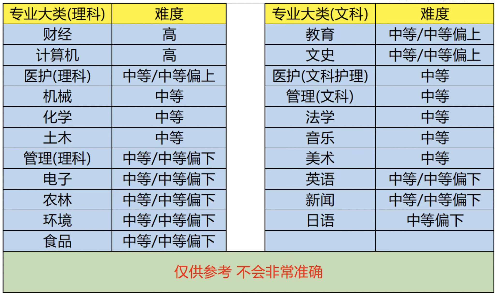
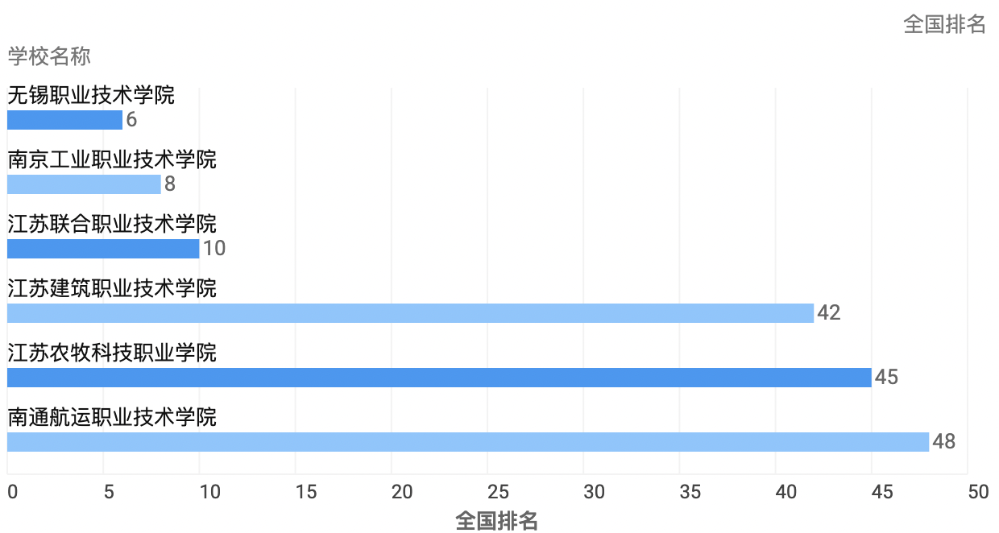

# 已搜集的情报
---

## 主线


## 情报来源
[江苏教育厅](http://jyt.jiangsu.gov.cn/art/2021/12/3/art_58320_10160490.html)

[知乎政策解读](https://zhuanlan.zhihu.com/p/435365336)

夸克高考

---
# 一.填志愿

<font color="green" size=1px>新增  </font> 各专业专转本难度


专业选个理工科就行（专科没有数学专业）
> ## 选学校



[江苏经贸职业学院在湖北招7人](https://zs.jsbc.edu.cn/2022/0622/c191a42251/page.htm)

[无锡职业技术学院](http://zs.wxit.edu.cn/2022/0624/c3493a97135/page.htm)

[连云港职业技术学院在湖北招8人](http://zs.wxit.edu.cn/2022/0624/c3493a97135/page.htm)

```
江苏工程职业技术学院不在湖北招生
```

```
可选的学校太多就不一一列举了，详细情况搜学校名字进入官网看招生计划
```

---

# 二.专转本

江苏专转本读三年本科读两年

其他地方专科两年本科两年

> ## 专转本选拔对象

1. 五年一贯制专转本

    选拔对象为列入国家普通高校招生计划，经省招生部门按规定程序正式录取的，在本省各类普通高校的专科三年级在籍学生（含普通高校对口单独招生学生、2019年秋季入学的面向社会人员开展全日制学历教育招生学生）

2. 三年制专转本

    经设区市招生部门按照规定程序正式录取的，在本省各类学校的五年一贯制高职的五年级在籍学生


> ## 报名
1. 修完学校教育教学计划规定内容达到毕业要求
2. 能正常取得全国或江苏计算机等级考试一级及以上证书。


> ## 考试内容

数学150

英语120 （四级710的17%）

专业课：满分230分（180理论+80实操）


> ## 学籍管理


<font color="red">  “专转本”学生不得转专业和转学。</font>

 “专转本”学生除国家和省有明确规定的，享受与转入学校本科生同等待遇。“专转本”学生毕业证书内容要按照国家规定填写。

 “专转本”学生毕业时，按国家有关本科毕业生的就业政策执行。

---
# 三.数学教师证考试
这个考试没要求必须是数学专业

> ## 选择科目
选高中还是初中

> ## 报名条件

普通高等学校在校三年级以上学生，可凭学校出具的在籍学习证明报考。


> ## 考试科目
小学教师考试科目：综合素质（小学）、教育教学知识与能力

初中教师考试科目：综合素质（中学）、教育知识与能力、学科知识与教学能力（初级中学）

高中教师考试科目：综合素质（中学）、教育知识与能力、学科知识与教学能力（高级中学）

---
# 四.考研

考研比较自由，在完成学校任务的情况下所有时间都可以用来准备考研科目

1. 考研可以提升学历
2. 跨专业考研也是一次转专业的机会
3. 

>## 考研科目
与专转本考试差不多<br>
1. 政治
2. 英语
3. 专业课
4. 数学一/二/三


---
# 五. 可借鉴经验

[这位大佬高中不想学考了专科，后来升了二本,工作后又考了非全日制硕士，技术也很强](https://www.bilibili.com/video/BV1QS4y1H78k?vd_source=cbeee4de613104de8bf0753a8c1feccc)

[]()


